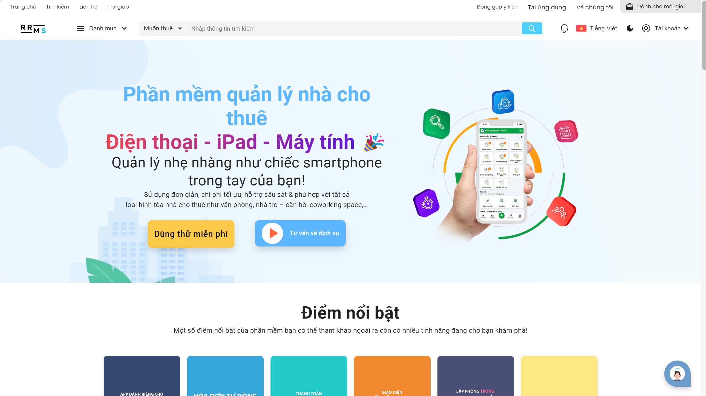

# 🏡 RRMS - Hệ thống quản lý nhà trọ

**Website**: [Xem tại đây](https://rrms.vercel.app)

---

## 📖 Giới thiệu

RRMS (Room Rental Management System) là một hệ thống quản lý nhà trọ được phát triển nhằm giúp người dùng dễ dàng tìm kiếm, quản lý và đặt phòng nhà trọ một cách nhanh chóng và hiệu quả. Hệ thống cung cấp giao diện thân thiện với người dùng cùng các chức năng đa dạng, từ việc xem thông tin phòng đến quản lý đặt chỗ.

---

## 🚀 Các công nghệ được sử dụng

Hệ thống được xây dựng dựa trên các công nghệ hiện đại và phổ biến trong ngành phát triển phần mềm:

  
  
  
  
  
  
  
  
  
    
  
  
  
  
  
  
  
  
    
    
    
    

---

## 👥 Những người đóng góp

Chúng tôi xin gửi lời cảm ơn đến những cá nhân đã tham gia phát triển hệ thống:

- [Trí Dũng](https://github.com/tridung778)
- [Cao Trí](https://github.com/trivu2004)
- [Minh Trung](https://github.com/chauminhtrung)
- [Kiến Quốc](https://github.com/KienQuocVn)
- [Quốc Thuận](https://github.com/thuanquoctr)
- [Tấn Tài](https://github.com/taitan0118)

---

## 📈 Lợi ích của hệ thống

- **Quản lý dễ dàng**: Giao diện trực quan giúp người dùng dễ dàng tìm kiếm và đặt phòng.
- **Bảo mật thông tin**: Hệ thống bảo vệ thông tin cá nhân của người dùng một cách nghiêm ngặt.
- **Tiết kiệm thời gian**: Giảm thiểu thời gian tìm kiếm và đặt phòng cho người dùng.

---

## 🎨 Hình ảnh dự án

---

## 📄 Tài liệu tham khảo

- [Hướng dẫn cài đặt](link_to_installation_guide)
- [Tài liệu API](https://decent-highly-bass.ngrok-free.app/swagger-ui/index.html)
- [Hỗ trợ người dùng](link_to_user_support)

---

**Liên hệ**: Nếu bạn có bất kỳ câu hỏi nào, vui lòng liên hệ với chúng tôi qua email: example@example.com.
